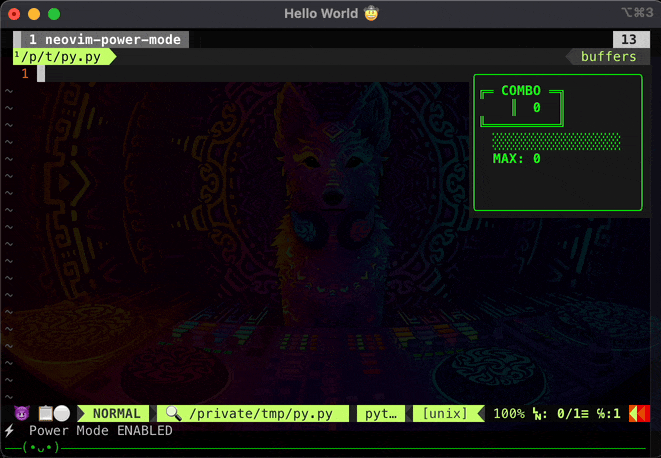

# neovim-power-mode

**VS Code Power Mode for Neovim** — animated particle explosions, combo counter, screen shake, and cyberpunk neon colors on every keystroke.

[](https://neovim.io)
[](LICENSE)

<table>
<tr>

<td>
<h2>Default Setup</h2>

</td>

<td>
<h2>Default + Shake + Firewall</h2>

</td>

</tr>
</table>

## Features

- **Particle explosions** on every keystroke with physics (gravity, drag, velocity)
- **Combo counter** with streak tracking, timeout bar, level escalation, and exclamation phrases
- **Screen shake** — combo window jitter, viewport scroll, or macOS window shake
- **Cyberpunk neon palette** — 8 configurable colors with `termguicolors` and cterm fallbacks
- **Backspace fire effect** — ember particles when deleting text
- **8 built-in presets** — explosion, fountain, rightburst, shockwave, emoji, stars, disintegrate, fire
- **Fully configurable** — every parameter tunable via Lua `setup()` or vim global variables
- **Custom presets** — define your own particle characters, physics, and direction
- **Pure Lua** — no external dependencies, no compilation required

## Requirements

- **Neovim ≥ 0.9**
- `set termguicolors` recommended (falls back to 256-color cterm otherwise)

## Installation

### [lazy.nvim](https://github.com/folke/lazy.nvim)

```lua
{ "axsaucedo/neovim-power-mode" }
```

> **That's it!** The plugin auto-enables with defaults. To customize:
> ```lua
> {
>   "axsaucedo/neovim-power-mode",
>   config = function()
>     require("power-mode").setup({
>       particles = { preset = "stars" },
>       shake = { mode = "scroll" },
>     })
>   end,
> }
> ```

### [packer.nvim](https://github.com/wbthomason/packer.nvim)

```lua
use { "axsaucedo/neovim-power-mode" }
```

### [vim-plug](https://github.com/junegunn/vim-plug)

```vim
Plug 'axsaucedo/neovim-power-mode'
```

And you can then configure with vim globals:

```vim
call plug#end()

" Optional: override defaults via vim globals
let g:power_mode_particle_preset = 'stars'
let g:power_mode_shake_mode = 'scroll'
```

### [mini.deps](https://github.com/echasnovski/mini.deps)

```lua
MiniDeps.add({ source = "axsaucedo/neovim-power-mode" })
```

### No plugin manager

```
mkdir -p ~/.local/share/nvim/site/pack/plugins/start
git clone https://github.com/axsaucedo/neovim-power-mode.git \
     ~/.local/share/nvim/site/pack/plugins/start/neovim-power-mode
```

## Quick Start

Just install the plugin — it auto-enables with defaults. Enter insert mode and start typing!

```lua
-- To customize (optional):
require("power-mode").setup({
  particles = { preset = "stars" },
  shake = { mode = "scroll" },
})
```

## Commands

| Command | Description |
|---------|-------------|
| `:PowerModeToggle` | Toggle power mode on/off |
| `:PowerModeEnable` | Enable power mode |
| `:PowerModeDisable` | Disable power mode |
| `:PowerModeStyle {preset}` | Switch particle preset |
| `:PowerModeShake {mode}` | Set shake mode: `none`, `scroll`, `applescript` |
| `:PowerModeFireWall {on\|off}` | Toggle fire wall on or off |
| `:PowerModeInterrupt {on\|off}` | Toggle interrupt-previous-particles |
| `:PowerModeCancel {on\|off}` | *(Deprecated)* Alias for `:PowerModeInterrupt` |
| `:PowerModeStatus` | Show current configuration |

## Presets

| Preset | Characters | Description |
|--------|-----------|-------------|
| `rightburst` | →➜➤▸⊳› | 80% rightward arrows (default) |
| `stars` | ✦✧⋆✶✸✹✺⊹ | Twinkling stars near cursor |
| `explosion` | ◆◇▲▼◈ | Radial burst, 70% upward bias |
| `fountain` | │╎┃╏╵ | Narrow upward geyser with gravity arc |
| `shockwave` | ░▒▓█ | Expanding ring, chars cycle as ring ages |
| `emoji` | ⭐🌟✨💫🔥💥 | Scattered emoji with upward float |
| `disintegrate` | *(buffer text)* | Nearby characters shatter outward |
| `fire` | 🔥▓▒░•· | Downward embers (backspace only) |

Switch at runtime: `:PowerModeStyle fountain`

## Fire Wall (Cacafire)

Rising fire from the bottom of the editor using a 2D heat-buffer algorithm
(inspired by cacafire). The fire grows with your combo level:

- **Levels 0–1**: No fire
- **Level 2**: Fire appears (2 rows)
- **Every 2 levels after**: +1 row of fire

When your combo resets (timeout or leaving insert mode), the fire naturally
cools and fades away.

Toggle at runtime: `:PowerModeFireWall on`

## Configuration

<details>
<summary><strong>Full configuration with defaults</strong></summary>

```lua
require("power-mode").setup({
  -- Enable power mode when Neovim starts (default: true)
  auto_enable = true,

  -- Particle system
  particles = {
    preset = "rightburst",      -- Built-in preset name or "custom"
    cancel_on_new = true,       -- Fade out previous particles on new keystroke
    cancel_fadeout_ms = 80,     -- Fadeout duration for cancelled particles (ms)
    count = { 6, 10 },         -- { min, max } particles per keystroke
    speed = { 5, 12 },         -- { min, max } initial speed
    lifetime = { 200, 500 },   -- { min, max } lifetime in ms
    gravity = 0.15,            -- Downward pull per frame
    drag = 0.96,               -- Velocity multiplier per frame (0-1)
    spread = { -2.79, -0.35 }, -- Angle range in radians
    upward_bias = 0.7,         -- Fraction of particles biased upward (0-1)
    chars = nil,               -- Override characters (nil = use preset default)
    pool_size = 60,            -- Floating window pool size (10-500)
    max_particles = 100,       -- Max active particles (10-500)
    avoid_cursor = true,       -- Don't render particles on cursor position
  },

  -- Backspace/delete fire effect
  backspace = {
    enabled = true,            -- Enable fire particles on backspace
    preset = "fire",           -- Preset for backspace effect
    chars = nil,               -- Override characters (nil = use preset)
    colors = { 5, 6 },        -- Color indices (5=orange, 6=gold)
  },

  -- Cyberpunk neon color palette
  -- Each: { gui_fg, gui_bg, ctermfg, ctermbg }
  colors = {
    color_1 = { "#00FFFF", "#002233", 14,  23  },  -- Cyan
    color_2 = { "#FF1493", "#330011", 199, 52  },  -- Pink
    color_3 = { "#BF00FF", "#1A0033", 129, 53  },  -- Purple
    color_4 = { "#39FF14", "#0A2200", 46,  22  },  -- Green
    color_5 = { "#FF6600", "#331100", 202, 94  },  -- Orange
    color_6 = { "#FFD700", "#332200", 220, 58  },  -- Gold
    color_7 = { "#00FF88", "#003318", 48,  23  },  -- Teal
    color_8 = { "#FF00FF", "#330033", 201, 53  },  -- Magenta
  },

  -- Combo counter
  combo = {
    enabled = true,                     -- Show combo counter
    position = "top-right",             -- "top-right"|"top-left"|"bottom-right"|"bottom-left"
    width = 20,                         -- Window width
    height = 7,                         -- Window height
    timeout = 3000,                     -- ms before combo resets
    thresholds = { 10, 25, 50, 100, 200 }, -- Level escalation thresholds
    shake = true,                       -- Shake combo window on keystroke
    shake_intensity = nil,              -- Override: { min, max } (nil = auto)
    exclamations = {                    -- Random phrases at milestones
      "UNSTOPPABLE!", "GODLIKE!", "RAMPAGE!", "MEGA KILL!",
      "DOMINATING!", "WICKED SICK!", "LEGENDARY!",
    },
    exclamation_interval = 10,          -- Show phrase every N keystrokes
    exclamation_duration = 1500,        -- ms to display phrase
    level_colors = {                    -- Colors per level: { gui_fg, ctermfg }
      [0] = { "#39FF14", 46 },         -- Green
      [1] = { "#00FFFF", 14 },         -- Cyan
      [2] = { "#FF1493", 199 },        -- Pink
      [3] = { "#BF00FF", 129 },        -- Purple
      [4] = { "#FF0000", 196 },        -- Red
    },
  },

  -- Screen shake
  shake = {
    mode = "none",           -- "none"|"scroll"|"applescript"
    interval = 1,            -- Shake every N keystrokes
    magnitude = nil,         -- Override magnitude (nil = auto from combo level)
    restore_delay = 50,      -- ms before restoring viewport (scroll mode)
  },

  -- Fire wall (cacafire heat-buffer) — rising fire from bottom edge
  fire_wall = {
    enabled = false,         -- true | false
    bottom_offset = 2,       -- rows to skip at bottom (statusline/cmdline)
    max_rows = 5,            -- maximum fire height in rows
  },

  -- Animation engine
  engine = {
    fps = 25,                -- Frames per second (10-60)
    stop_delay = 2000,       -- ms after leaving insert to stop engine
  },
})
```

</details>

## Custom Presets

Define entirely custom particle behavior:

```lua
require("power-mode").setup({
  particles = {
    preset = "custom",
    custom = {
      chars = { "⚔", "🗡", "💀", "☠" },
      count = { 5, 8 },
      speed = { 6, 14 },
      lifetime = { 200, 400 },
      gravity = 0.10,
      drag = 0.95,
      spread = { -2.5, -0.5 },
      upward_bias = 0.8,
    },
  },
})
```

Mix-and-match: override specific params while using a built-in preset:

```lua
require("power-mode").setup({
  particles = {
    preset = "explosion",
    chars = { "★", "☆", "✡" },    -- Custom chars with explosion physics
    count = { 10, 15 },            -- More particles
  },
})
```

## Colors

The plugin uses 8 color slots for particles. Override any slot:

```lua
require("power-mode").setup({
  colors = {
    color_1 = { "#FF0000", "#110000", 196, 52 },  -- Red
    -- color_2..8 keep defaults
  },
})
```

Via vim globals (fg only):
```vim
let g:power_mode_color_1 = '#FF0000'
```

> **Tip:** Add `set termguicolors` to your config for the full neon experience.

## Combo System

The combo counter tracks consecutive keystrokes:

```
╔═ COMBO ═╗
║   42   ║
╚═════════╝
  ████████░░░░
  MAX: 127
  GODLIKE!
```

- **Levels** escalate at configurable thresholds (default: 10, 25, 50, 100, 200)
- **Colors** change per level (green → cyan → pink → purple → red)
- **Exclamations** appear at milestones ("UNSTOPPABLE!", "GODLIKE!", etc.)
- **Shake** jitters the combo window on each keystroke (intensity scales with level)
- **Timeout bar** drains over 3 seconds; combo resets when empty

## 📳 Shake Modes

| Mode | Description | Platform |
|------|-------------|----------|
| `none` | No screen shake (default) | All |
| `scroll` | Viewport jitters via `winrestview` | All |
| `applescript` | iTerm2 window physically shakes | macOS only |

```lua
require("power-mode").setup({
  shake = {
    mode = "scroll",
    interval = 2,        -- Shake every other keystroke
    restore_delay = 50,  -- ms before viewport snaps back
  },
})
```

## 🔧 Vim Global Variables

For vimscript users, all options are available as `g:power_mode_*`:

```vim
let g:power_mode_auto_enable = 1
let g:power_mode_particle_preset = 'explosion'
let g:power_mode_particle_cancel_on_new = 1
let g:power_mode_shake_mode = 'scroll'
let g:power_mode_fire_wall_enabled = 1
let g:power_mode_combo_enabled = 1
let g:power_mode_combo_position = 'top-right'
let g:power_mode_engine_fps = 25
let g:power_mode_color_1 = '#FF0000'
```

Priority: `setup()` options > vim globals > defaults.

## ❓ FAQ / Troubleshooting

**Colors look plain or wrong?**
Add `set termguicolors` to your Neovim config. Without it, the plugin falls back to 256-color cterm values.

**Particles feel laggy?**
- Lower FPS: `engine = { fps = 15 }`
- Reduce particle count: `particles = { count = { 3, 5 }, pool_size = 30 }`
- Enable cancel-on-new (default): `particles = { cancel_on_new = true }`

**Not working inside tmux?**
Floating windows should work in tmux. Ensure you're running Neovim ≥ 0.9 and tmux ≥ 3.3.

**AppleScript shake doesn't work?**
- Only works with iTerm2 on macOS
- Grant Accessibility permissions to iTerm2 in System Preferences
- May need to allow osascript in security settings

**How to use programmatically?**
```lua
local pm = require("power-mode")
pm.enable()
pm.disable()
pm.toggle()
pm.is_enabled()
pm.status()
```

## 📄 License

[MIT](LICENSE)
